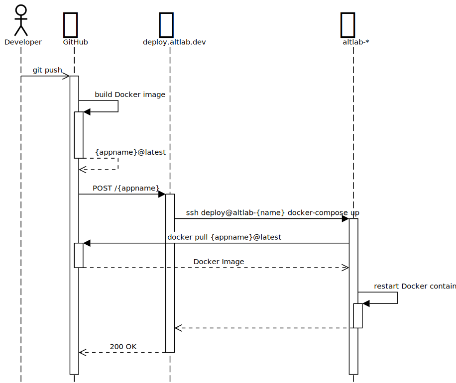

# deploy.altlab.dev

ALTLab's deployment server. Enables web application redeployment via HTTPS.

## Deployment Process

1. A developer pushes to the default branch of one of our apps (e.g. gunaha, [itwêwina][itwewina]).
1. A GitHub Action workflow is triggered that builds a Docker image of the application.
1. The GitHub Action workflow then sends a POST request to a webhook at `deploy.altlab.dev` (this app). (See the [API docs](./docs/API.md).)
1. This app pulls the Docker image for that application and redeploys it in ALTLab's private network.

## Documentation

* [API](./docs/API.md)
* [How to register an application with the API](./docs/registration.md)
* [How to configure the servers](./docs/server-config.md)

## How to check the logs

Use `journalctl` to monitor the logs for `deploy.altlab.dev`:

 - `sudo journalctl -lf -u deploy.altlab.dev` (follow mode)
 - `sudo journalctl -l -u deploy.altlab.dev --since='15m'` (last 15 minutes)

<!-- Links -->
[itwewina]: https://itwewina.altlab.app/
