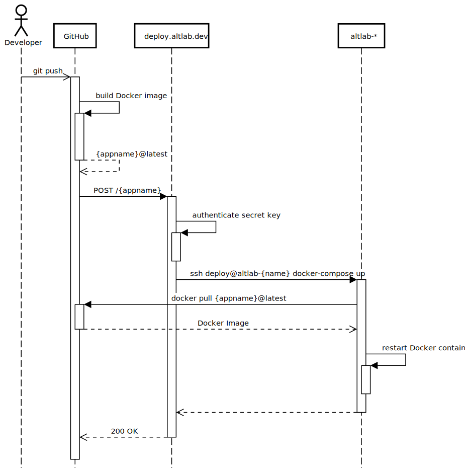

# deploy.altlab.dev

ALTLab's deployment server. Enables web application redeployment via HTTPS.

## Deployment Process

1. A developer pushes to the default branch of one of our apps (e.g. gunaha, [itwêwina][itwewina]).
1. A GitHub Action workflow is triggered that builds a Docker image of the application.
1. The GitHub Action workflow then sends a POST request to a webhook at `deploy.altlab.dev` (this app). (See the [API docs](./docs/API.md).)
1. This app pulls the Docker image for that application and redeploys it in ALTLab's private network.

## Documentation

* [API](./docs/API.md)
* [How to register an application with the API](./registration.md)
* [How to configure the servers](./docs/server-config.md)

## Notes

* The docker service should restart all running containers when restarted. See <https://stackoverflow.com/a/18797089/6626414>.
* You can monitor the logs in `deploy.gunicorn`:
  - `sudo journalctl -lfu deploy.gunicorn`
  - `sudo journalctl -lu deploy.gunicorn --since='15m'` (last 15 minutes)

<!-- Links -->
[itwewina]: https://itwewina.altlab.app/
